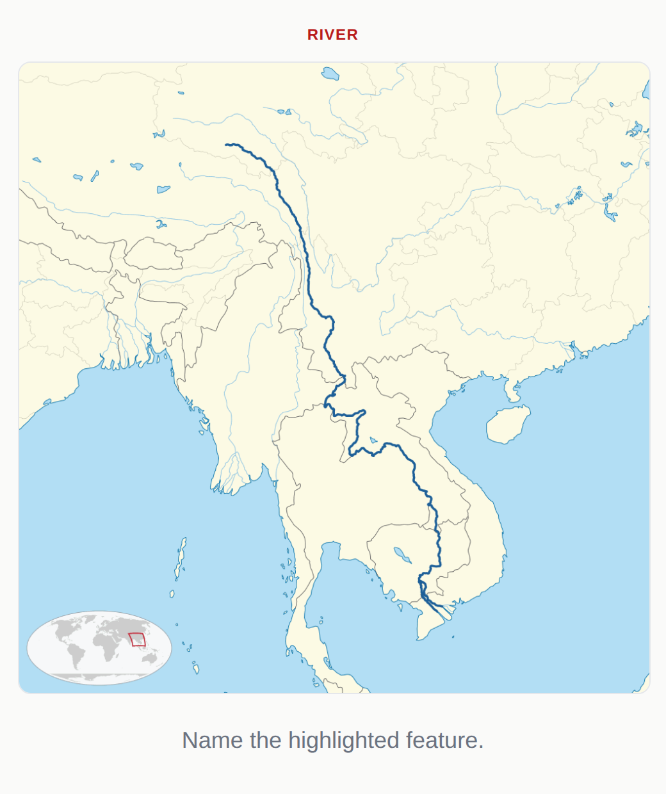
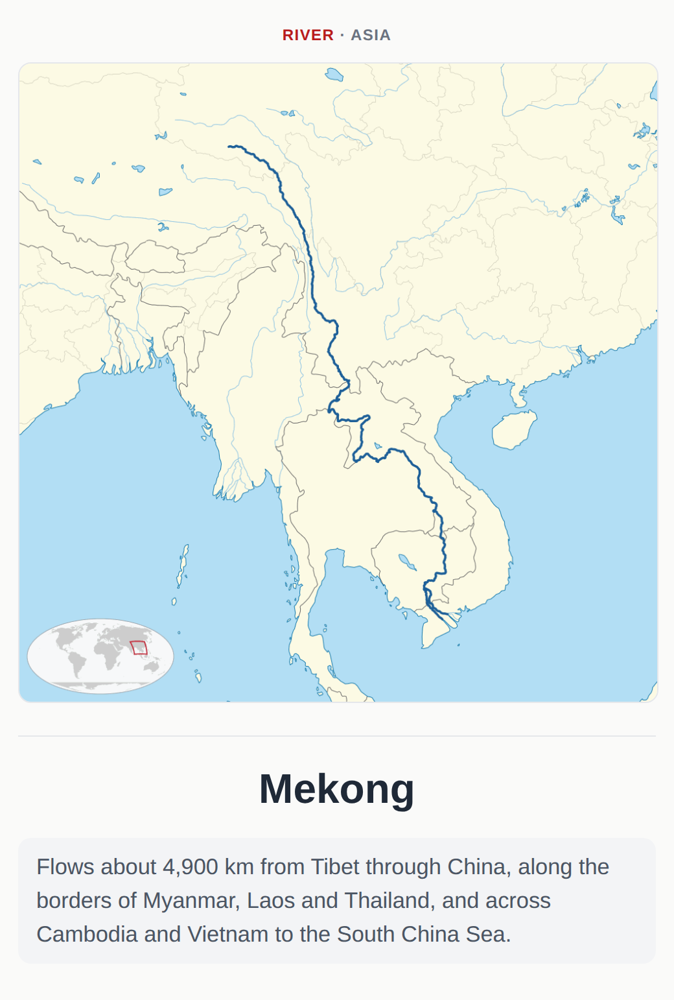
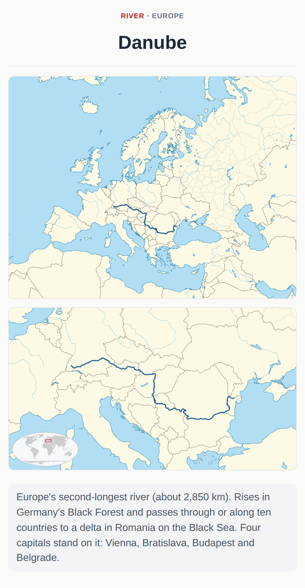
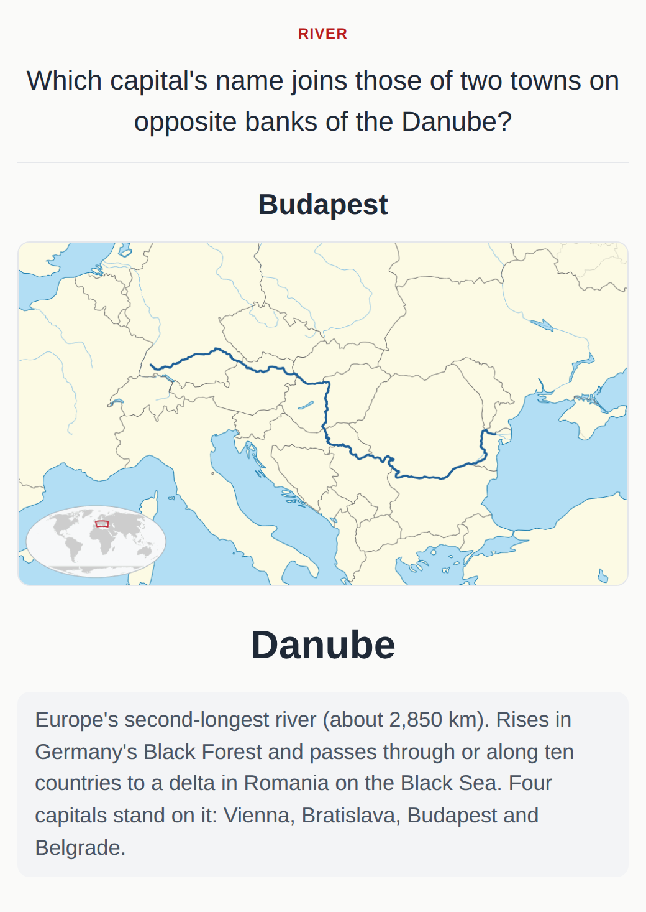

# Physical Geography for Anki

An Anki deck of the world's major rivers, mountain ranges, deserts, lakes, plateaus, plains and
peninsulas. It's built as a companion to
[Ultimate Geography](https://github.com/anki-geo/ultimate-geography): it covers what Ultimate
Geography doesn't, and its maps use the same style.

**[Download Physical_Geography.apkg](https://github.com/jupsh/anki-physical-geography/releases/latest/download/Physical_Geography.apkg)**,
then in Anki choose **File → Import**.

## What's in it

184 features, 516 cards:

| Subdeck | Features |
|---|---|
| Rivers | 50 |
| Mountain Ranges | 34 |
| Lakes | 28 |
| Plateaus, Plains & Regions | 27 |
| Peninsulas | 23 |
| Deserts | 22 |

Each feature has a _Map → Name_ card and a _Name → Map_ card. On the _Name → Map_ card you point
to the feature on a blank map of its continent; the back highlights it on the same map, so you can
check exactly where you pointed. 148 features also have a _Fact_ card: one question that ties the
feature to countries, seas and cities.

<table>
  <tr><th scope="col" colspan="2">Map → Name</th></tr>
  <tr><th scope="col">Front</th><th scope="col">Back</th></tr>
  <tr>
    <td></td>
    <td></td>
  </tr>
</table>

<table>
  <tr><th scope="col" colspan="2">Name → Map</th></tr>
  <tr><th scope="col">Front</th><th scope="col">Back</th></tr>
  <tr>
    <td></td>
    <td></td>
  </tr>
</table>

<table>
  <tr><th scope="col" colspan="2">Fact</th></tr>
  <tr><th scope="col">Front</th><th scope="col">Back</th></tr>
  <tr>
    <td></td>
    <td></td>
  </tr>
</table>

### Custom study

Every note is tagged with its subdeck and continent (`PG::Rivers`, `PG::Europe`, …), so you can
build [filtered decks](https://docs.ankiweb.net/filtered-decks.html) for narrower goals:

- `card:"Map → Name"` to learn locations and nothing else;
- `tag:PG::Rivers tag:PG::Europe` to learn Europe's rivers;
- `-card:Fact` to skip the fact cards;
- `tag:PG::Africa or tag:PG::Asia` to focus on two continents.

## Maps

The maps are drawn from [Natural Earth](https://www.naturalearthdata.com/) data (public domain) in
Ultimate Geography's colours, with a world locator in one corner. Each map is centred on its
feature (Lambert azimuthal equal-area), so shapes stay true at any latitude. Unlike Ultimate
Geography's maps, they also show major rivers and the state/province lines of the largest
countries, faintly, as landmarks.

The _Name → Map_ cards also use a fixed map of each continent, in the same style but without the
locator.

The outlines of regions like deserts and mountain ranges are Natural Earth's, and some are rough.
They show where a feature is, not its exact boundary.

## Building it yourself

Needs [uv](https://docs.astral.sh/uv/) and the Cairo library (for `cairosvg`; e.g.
`apt install libcairo2` or `brew install cairo`).

```sh
uv run python physical_geography/build.py                 # writes dist/Physical_Geography.apkg
uv run python physical_geography/build.py --html out.html # plus an HTML preview of every note
uv run python physical_geography/build.py --only Nile     # just matching features, into build/
```

The first build downloads the Natural Earth files (~30 MB) into `build/natural_earth/` and takes
about a minute. Maps are then cached in `build/physical_geography/`.

Note GUIDs come from each feature's kind and name, so re-importing a new version updates your
existing notes and keeps your progress. Renaming a feature, though, adds it as a new note.

## Contributing

Spotted a mistake, or think a feature is missing? [Open an issue](https://github.com/jupsh/anki-physical-geography/issues).
To change the deck yourself, see [CONTRIBUTING.md](CONTRIBUTING.md).

## License

Public domain ([Unlicense](LICENSE.md)), like Ultimate Geography. The maps are generated from
public-domain Natural Earth data.
